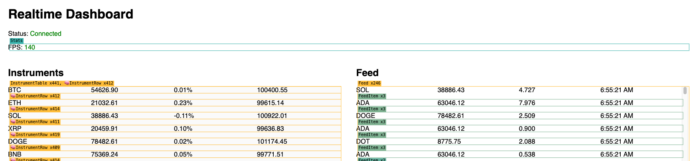

# Socket Demo

A small demo app for experimenting with React performance under a high-frequency stream of WebSocket updates.

The server uses Socket.IO to generate a continuous stream of instrument updates and feed events. The client renders them in real time and serves as a playground for testing different rendering optimizations such as batching, `requestAnimationFrame`, `React.memo`, external stores, and list virtualization.

The project is intentionally simple. The goal is to make performance problems easy to reproduce and compare.



## Run locally

Install dependencies:

```bash
npm install
```

Start the server:

```bash
npm run dev
```

Start the client in a separate terminal:

```bash
cd client
npm install
npm run dev
```

Open the URL shown by Vite.

## Adjust the load

The server load can be configured with variables:

- `INSTRUMENT_UPDATES_PER_SECOND`
- `FEED_EVENTS_PER_SECOND`

The default values are intentionally moderate. Increase them to make the rendering bottlenecks more obvious.
